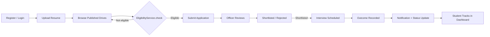
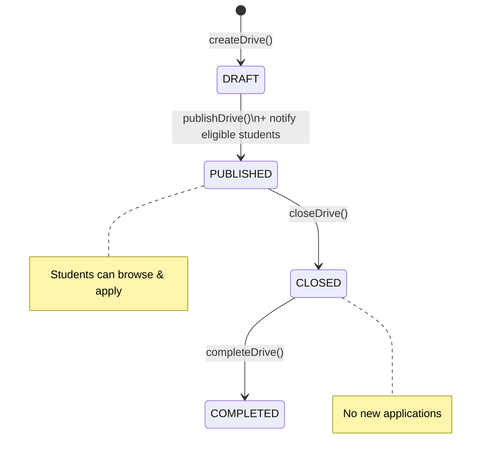
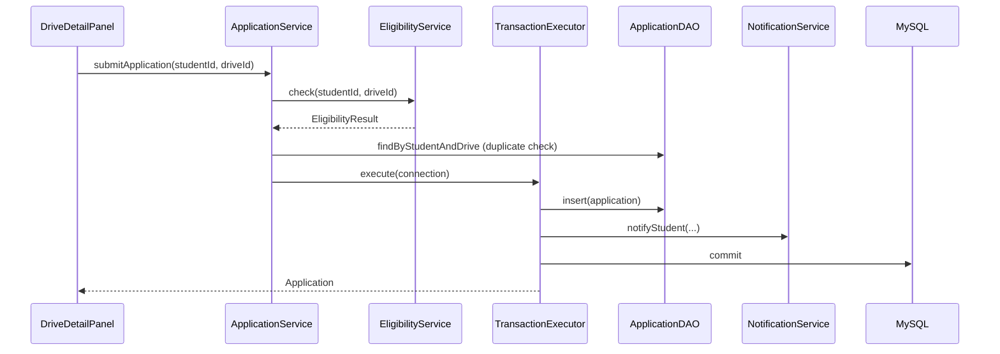
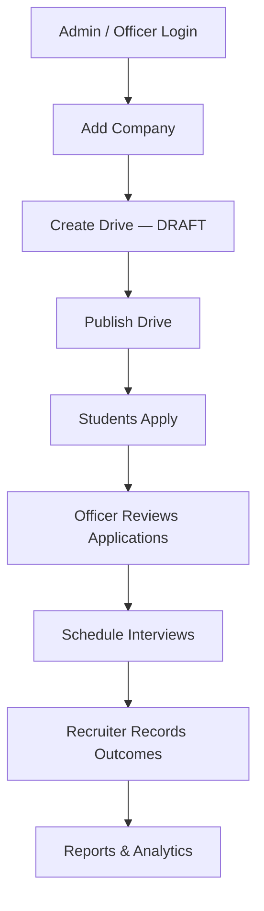
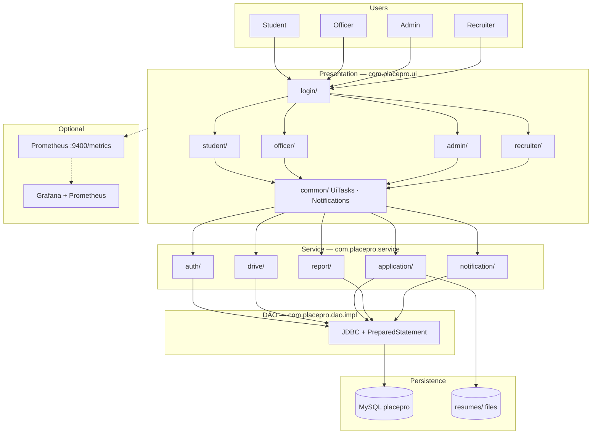
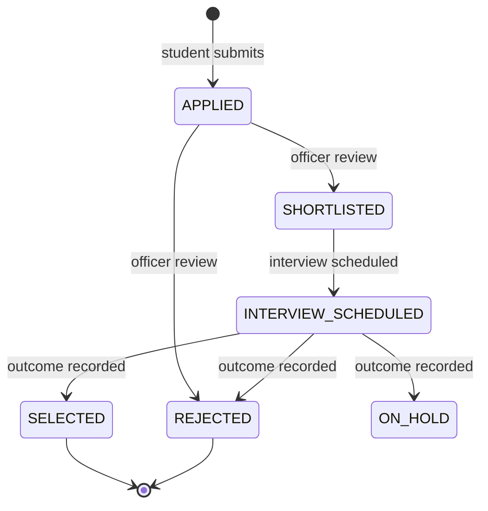

# PlacePro

**Smart Placement Management System**

*A desktop platform that centralizes campus placement operations — from student registration to final reporting.*

Built for college **Training & Placement Offices (TPOs)** — one Java Swing app on the campus LAN replaces scattered spreadsheets, email threads, and paper registers with a **single MySQL-backed source of truth**.

Every stakeholder gets a dedicated console: students apply and track progress, officers publish drives and run interviews, admins view analytics and manage users, and recruiters work shortlisted candidates — all reading and writing the same database in real time.


|                                                     |                                             |                                          |                                                    |
| --------------------------------------------------- | ------------------------------------------- | ---------------------------------------- | -------------------------------------------------- |
| 🎓 **Student** Browse drives · Apply · Track status | 📋 **Officer** Companies · Drives · Reports | 📊 **Admin** Analytics · User management | 💼 **Recruiter** Shortlist · Interviews · Outcomes |


|                  |     |                 |     |                      |     |                      |
| ---------------- | --- | --------------- | --- | -------------------- | --- | -------------------- |
| **4** User Roles | •   | **9** DB Tables | •   | **19** Core Features | •   | **1** Fat JAR Deploy |


**[Overview](#overview)** · **[Quick Start](#getting-started)** · **[Architecture](#system-architecture)** · **[Docs](docs/README.md)** · **[GitHub Repo](https://github.com/pnvharisuryaprakashreddy/PlacePro)**

---

**Table of Contents**

- [Overview](#overview)
- [The Problem & The Solution](#the-problem--the-solution)
- [Features by Role](#features-by-role)
- [Workflows](#workflows)
- [System Architecture](#system-architecture)
- [Database Design](#database-design)
- [Tech Stack](#tech-stack)
- [Getting Started](#getting-started)
- [Project Structure](#project-structure)
- [Screenshots](#screenshots)
- [Testing & Documentation](#testing--documentation)
- [Roadmap](#roadmap)
- [Author](#author)

---

## Overview

PlacePro is a **Java Swing desktop application** built for college Training and Placement Offices (TPOs). It replaces fragmented spreadsheets, email threads, and paper registers with a single **MySQL-backed system** that every stakeholder accesses through a role-specific console.

Students browse drives and track applications. Officers publish drives, review candidates, and schedule interviews. Administrators gain analytics and user management. Recruiters work shortlisted candidates and record outcomes — all against one shared database on the campus LAN.

> Full product specification: `[PRD.md](PRD.md)` · `[PlacePro_PRD.pdf](PlacePro_PRD.pdf)`

---

## The Problem & The Solution


| Without PlacePro                                        | With PlacePro                                                |
| ------------------------------------------------------- | ------------------------------------------------------------ |
| Drive details scattered across emails and notice boards | Published drives with eligibility rules in one database      |
| Duplicate spreadsheet entries and version conflicts     | Unique constraints — one application per student per drive   |
| Students asking officers for status updates             | Self-service application tracking + in-app notifications     |
| Manual report assembly at season end                    | Filtered reports exported to CSV/PDF; admin analytics charts |


PlacePro is designed for **local-network deployment** on lab and office machines during placement season, with optional Prometheus/Grafana monitoring for IT staff.

---

## Features by Role

### Student (`ui.student`)


| Module                   | What it does                                                                                             |
| ------------------------ | -------------------------------------------------------------------------------------------------------- |
| **Registration & Login** | Self-register with validation; BCrypt-hashed credentials; login lockout after 5 failures                 |
| **Dashboard**            | KPI cards — active drives, deadlines, applied/shortlisted/interview/selected counts; recent drives table |
| **Browse Drives**        | List published drives; open detail view with eligibility check                                           |
| **Apply**                | Submit application linked to current resume; duplicate prevention enforced in DB + service layer         |
| **Application Tracking** | Status timeline across all drives (`APPLIED` → `SELECTED` / `REJECTED`)                                  |
| **Resume Upload**        | Store PDF/DOC on disk; metadata in MySQL; size limit from config                                         |
| **Notifications**        | Bell icon with unread count; filterable inbox (drive published, status change, interview, general)       |


### Placement Officer (`ui.officer`)


| Module            | What it does                                                                                                   |
| ----------------- | -------------------------------------------------------------------------------------------------------------- |
| **Companies**     | CRUD, search by name/industry/active status, filter by drive activity, drill-down to drive outcomes            |
| **Students**      | Paginated directory — search by name, roll, branch, CGPA, placement status; view profile, applications, resume |
| **Drives**        | Create/edit drives; lifecycle **Draft → Published → Closed → Completed** with eligibility criteria             |
| **Applications**  | Review queue per drive; bulk status updates; schedule interview rounds; record outcomes                        |
| **Reports**       | Placement summary, company stats, applicant funnel, student records — **CSV & PDF export**                     |
| **Notifications** | Same in-app inbox pattern as other roles                                                                       |


### Administrator (`ui.admin`)

Everything in the **Officer console**, plus:


| Module                  | What it does                                                                                     |
| ----------------------- | ------------------------------------------------------------------------------------------------ |
| **Analytics Dashboard** | Live KPIs + JFreeChart bar/pie charts (placements by department, top companies, conversion rate) |
| **User Management**     | Activate/deactivate students, officers, recruiters; admin password reset                         |


### Recruiter (`ui.recruiter`)


| Module                 | What it does                                                                |
| ---------------------- | --------------------------------------------------------------------------- |
| **Drives & Shortlist** | Company-scoped view of drives and shortlisted candidates; open resumes      |
| **Interviews**         | View assigned rounds; record outcomes (`SELECTED` / `REJECTED` / `ON_HOLD`) |
| **Notifications**      | In-app alerts scoped to the logged-in recruiter                             |


**Cross-cutting capabilities**

- **Layered architecture** — Swing UI → Service → DAO → MySQL (`AppContext` wiring)
- **Authorization** — `AuthorizationHelper` enforces role checks on every service method
- **Transactions** — Application submit + notification in one JDBC transaction
- **Session idle timeout** — 15-minute inactivity prompt; auto-logout on shared lab machines
- **Logging** — SLF4J + Logback → `logs/placepro.log`
- **Monitoring (optional)** — Embedded Prometheus `/metrics` on port 9400; Docker Compose stack in `monitoring/`


---

## Workflows

### Student placement journey

Derived from PRD §12.1 and implemented in `StudentConsolePanel`, `ApplicationService`, and `InterviewService`.




### Drive lifecycle

Implemented in `DriveService` with status guards on every transition.




### Application submit (service layer)

End-to-end path when a student clicks **Apply** — matches PRD §17.9.




### Administrative setup flow

From PRD §12.2 — officer/admin console tabs.




---

## System Architecture

Five-layer design as implemented under `com.placepro`:




**Request path:** UI action → `UiTasks.run()` (background thread) → Service (auth + business rules) → DAO (parameterized SQL) → MySQL → result back to EDT.

---

## Database Design

Nine InnoDB tables in the `placepro` database. Key constraints:

- `applications`: unique `(student_id, drive_id)` — no duplicate applications
- `interview_schedule`: unique `(application_id, round_number)` — one row per round
- `resumes`: file bytes on disk; DB stores path and metadata

**Entity-Relationship Diagram** (from `V1__init_schema.sql`)

```mermaid
erDiagram
    companies ||--o{ recruiters : employs
    companies ||--o{ placement_drives : hosts
    placement_officers ||--o{ placement_drives : creates
    students ||--o{ resumes : uploads
    students ||--o{ applications : submits
    placement_drives ||--o{ applications : receives
    resumes ||--o{ applications : attached_to
    applications ||--o{ interview_schedule : has_rounds
    placement_officers ||--o{ interview_schedule : schedules
    recruiters ||--o{ interview_schedule : schedules
    students ||--o{ notifications : receives
    placement_officers ||--o{ notifications : receives
    recruiters ||--o{ notifications : receives

    students {
        int student_id PK
        string roll_number UK
        string email UK
        decimal cgpa
        string branch
    }
    placement_officers {
        int officer_id PK
        enum role OFFICER_ADMIN
    }
    companies {
        int company_id PK
        string company_name UK
    }
    recruiters {
        int recruiter_id PK
        int company_id FK
    }
    placement_drives {
        int drive_id PK
        enum status DRAFT_PUBLISHED_CLOSED_COMPLETED
        datetime application_deadline
    }
    resumes {
        int resume_id PK
        int student_id FK
        string file_path
    }
    applications {
        int application_id PK
        enum status APPLIED_to_SELECTED
    }
    interview_schedule {
        int interview_id PK
        int round_number
        enum outcome PENDING_SELECTED_REJECTED_ON_HOLD
    }
    notifications {
        int notification_id PK
        enum notification_type
        bool is_read
    }
```


Full DDL: `[db/migrations/V1__init_schema.sql](db/migrations/V1__init_schema.sql)`


### Application status flow




---

## Tech Stack


| Layer       | Technology             | Purpose                           |
| ----------- | ---------------------- | --------------------------------- |
| Language    | Java 11                | Core application                  |
| UI          | Java Swing             | Role-based desktop consoles       |
| Build       | Maven + Shade plugin   | Fat JAR → `target/placepro.jar`   |
| Database    | MySQL 8+               | Shared persistence (InnoDB)       |
| Data access | JDBC                   | Parameterized queries, no ORM     |
| Security    | jBCrypt                | Password hashing (work factor 10) |
| Reporting   | Apache PDFBox          | PDF export                        |
| Analytics   | JFreeChart             | Admin bar/pie charts              |
| JSON        | Gson                   | Serialization utility             |
| Logging     | SLF4J + Logback        | `logs/placepro.log`               |
| Monitoring  | Prometheus Java client | Optional `/metrics` endpoint      |
| Ops stack   | Docker Compose         | Optional Prometheus + Grafana     |
| Testing     | JUnit 5                | Service-layer unit tests          |


---

## Getting Started

### Prerequisites

- JDK **11+**
- Maven **3.8+**
- MySQL **8.0+**

### 1 · Clone

```bash
git clone https://github.com/pnvharisuryaprakashreddy/PlacePro.git
cd PlacePro
```

### 2 · Configure

```bash
cp src/main/resources/config.properties.example src/main/resources/config.properties
```

```properties
db.url=jdbc:mysql://localhost:3306/placepro
db.user=your_username
db.password=your_password
resumes.directory=resumes
resumes.maxSizeKb=2048
metrics.port=9400
```

> `config.properties` is git-ignored. Never commit credentials.

### 3 · Database setup

From `[docs/DB_SETUP.md](docs/DB_SETUP.md)`:

```bash
mysql -u your_username -p < db/migrations/V1__init_schema.sql
mysql -u your_username -p < db/migrations/V2__seed_data.sql
mysql -u your_username -p < db/migrations/V2__search_indexes.sql
```

Verify:

```bash
mysql -u your_username -p -e "USE placepro; SHOW TABLES;"
```

**Seed data demo accounts** (after `V2__seed_data.sql`)


| Role      | Email                                 | Password       |
| --------- | ------------------------------------- | -------------- |
| Officer   | `anita.rao@placepro.local`            | `Password@123` |
| Admin     | `rahul.mehta@placepro.local`          | `Password@123` |
| Student   | `aarav.sharma@student.placepro.local` | `Password@123` |
| Recruiter | `karan.malhotra@technova.example`     | `Password@123` |


Additional seed users are in `[db/migrations/V2__seed_data.sql](db/migrations/V2__seed_data.sql)`.


### 4 · Build & run

```bash
mvn clean package
java -jar target/placepro.jar
```

Select a role on the login screen to begin.

**Optional: Prometheus + Grafana monitoring**

Each client exposes metrics at `http://localhost:9400/metrics`. See `[docs/MONITORING.md](docs/MONITORING.md)`.

```bash
cd monitoring
docker compose up -d
```


| Service    | URL                                            |
| ---------- | ---------------------------------------------- |
| Prometheus | [http://localhost:9090](http://localhost:9090) |
| Grafana    | [http://localhost:3000](http://localhost:3000) |


---

## Project Structure

```
PlacePro/
├── db/migrations/                 # Schema, seed data, indexes
│   ├── V1__init_schema.sql
│   ├── V2__seed_data.sql
│   └── V2__search_indexes.sql
├── docs/                          # DB_SETUP, MONITORING, BACKUP guides
├── monitoring/                    # docker-compose.yml, prometheus.yml
├── src/main/java/com/placepro/
│   ├── Main.java                  # Entry point + metrics server startup
│   ├── config/                    # AppConfig
│   ├── dao/                       # Interfaces + impl/ JDBC classes
│   ├── model/                     # Domain entities (Student, Drive, …)
│   ├── monitoring/                # MetricsRegistry, DaoMetrics proxy
│   ├── service/                   # Business logic by domain
│   │   ├── auth/                  # AuthService, SessionManager
│   │   ├── drive/                 # DriveService, EligibilityService
│   │   ├── application/           # ApplicationService, InterviewService
│   │   ├── report/                # ReportService, analytics DTOs
│   │   ├── notification/          # NotificationService
│   │   ├── student/               # Dashboard, tracking, directory
│   │   ├── recruiter/             # RecruiterService
│   │   └── admin/                 # UserManagementService
│   ├── ui/
│   │   ├── login/                 # Role selection, login, registration
│   │   ├── student/               # Dashboard, browse, apply, resume
│   │   ├── officer/               # Companies, drives, apps, reports
│   │   ├── admin/                 # Analytics, user management
│   │   ├── recruiter/             # Shortlist, interviews
│   │   └── common/                # Notifications, UiTasks, idle timeout
│   └── util/                      # DBConnection, AppLog, transactions
├── src/test/                      # JUnit 5 tests
├── pom.xml
└── README.md
```

---

## Screenshots

**Screenshot gallery** — TODO: add images to `docs/screenshots/`


| Screen                       | Path                                     |
| ---------------------------- | ---------------------------------------- |
| Login — role selection       | `docs/screenshots/login-selection.png`   |
| Student dashboard            | `docs/screenshots/student-dashboard.png` |
| Drive detail & apply         | `docs/screenshots/student-apply.png`     |
| Officer — application review | `docs/screenshots/officer-review.png`    |
| Officer — interview schedule | `docs/screenshots/officer-interview.png` |
| Reports & PDF export         | `docs/screenshots/officer-reports.png`   |
| Admin analytics              | `docs/screenshots/admin-analytics.png`   |
| Notification inbox           | `docs/screenshots/notifications.png`     |


---

## Testing & Documentation

### Run tests

```bash
mvn test
```

Coverage includes `AuthService` (registration, login, lockout), `EligibilityService`, `ApplicationService` (duplicates, transactional rollback), and `DriveService` (lifecycle transitions).

### Guides


| Document                                   | Description                          |
| ------------------------------------------ | ------------------------------------ |
| `[docs/DB_SETUP.md](docs/DB_SETUP.md)`     | Schema migration and verification    |
| `[docs/MONITORING.md](docs/MONITORING.md)` | Prometheus/Grafana setup             |
| `[docs/BACKUP.md](docs/BACKUP.md)`         | Pre-season mysqldump + resume backup |
| `[PRD.md](PRD.md)`                         | Full product requirements            |


### Pre-season backup

Back up **both** the MySQL database and the `resumes/` directory. See `[docs/BACKUP.md](docs/BACKUP.md)`.

---

## Roadmap

### Delivered in v1.0

- [x] Role-based Swing consoles (Student, Officer, Admin, Recruiter)
- [x] Company & drive management with lifecycle states
- [x] Eligibility checking and application submission
- [x] Interview scheduling and outcome recording
- [x] In-app notifications
- [x] Reports (CSV/PDF) and admin analytics charts
- [x] Student directory with paginated search
- [x] Optional Prometheus monitoring stack
- [x] Session idle timeout and structured logging

### Future enhancements

From PRD §19:

- [ ] Email notifications
- [ ] SMS alerts
- [ ] AI resume analysis
- [ ] Online coding tests
- [ ] Video interview integration
- [ ] Cloud deployment
- [ ] Mobile companion app
- [ ] Resume compatibility scoring
- [ ] Extended analytics (trends, year-over-year)
- [ ] Self-service company portal
- [ ] In-app student skill assessments

---

## Author


**P N V Hari Surya Prakash Reddy**

[GitHub](https://github.com/pnvharisuryaprakashreddy)

  


Academic project · 2026 · Built with Java Swing, JDBC & MySQL

