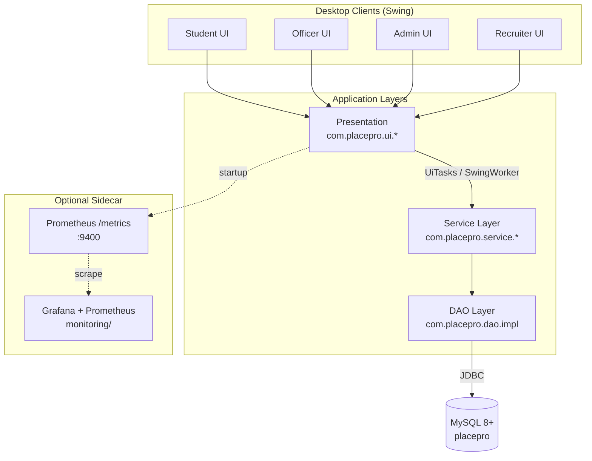
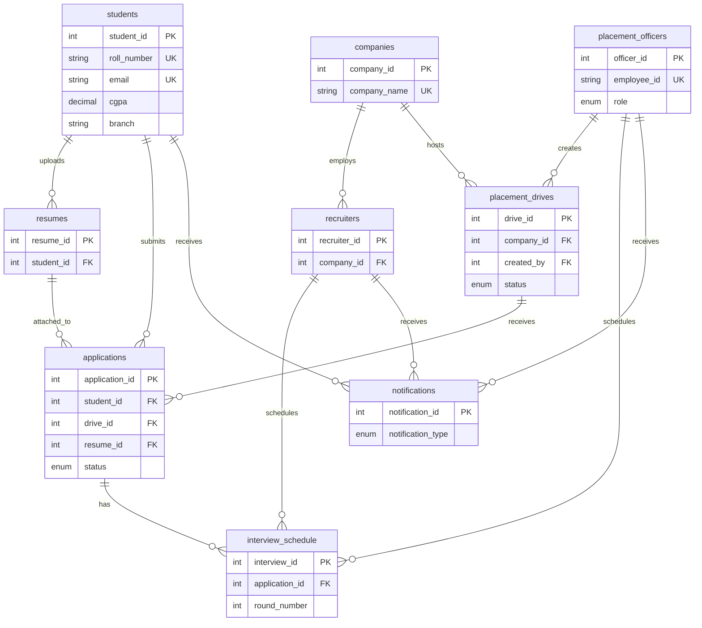

<div align="center">

<!-- Animated typing header -->


<br />

*One desktop app. One shared database. Every placement role covered.*

<br />

<!-- Badges -->


<br />


</div>

---

<details open>
<summary><strong>📑 Table of Contents</strong></summary>

- [Why PlacePro](#-why-placepro)
- [Feature Showcase](#-feature-showcase)
- [Tech Stack](#-tech-stack)
- [Architecture](#-architecture)
- [Screenshots / Demo](#-screenshots--demo)
- [Quick Start](#-quick-start)
- [Project Structure](#-project-structure)
- [Database Schema](#-database-schema)
- [Roadmap](#-roadmap)
- [Contributing](#-contributing)
- [Star History](#-star-history)
- [License & Author](#-license--author)

</details>

---

## 💡 Why PlacePro

Spreadsheets break during placement season. Emails get lost. Students chase officers for status updates nobody has time to send.

**PlacePro fixes that** with a role-aware Java Swing desktop client and a single MySQL source of truth — drives go live in minutes, applications stay deduplicated, interviews get scheduled, and reports export to CSV/PDF without copy-pasting from five different files.

Built for real TPO workflows, not a toy CRUD demo.

---

## ✨ Feature Showcase

<table>
<tr>
<td width="50%" valign="top">

### 🎓 Student
- Register, log in, and view a KPI dashboard
- Browse published drives with eligibility checks
- Apply with your current resume attached
- Track application status across all drives
- Upload resumes & receive in-app notifications

</td>
<td width="50%" valign="top">

### 🏢 Placement Officer
- Manage companies with search & drive-status filters
- Run the full drive lifecycle (draft → publish → close → complete)
- Review applications & bulk-update statuses
- Schedule interview rounds & record outcomes
- Generate tabular reports with CSV/PDF export

</td>
</tr>
<tr>
<td width="50%" valign="top">

### 🛡️ Administrator
- Everything officers can do, plus analytics charts
- KPI dashboard: placements, conversion rate, top recruiters
- Activate/deactivate users & reset passwords
- Department-level placement insights via JFreeChart

</td>
<td width="50%" valign="top">

### 🤝 Recruiter
- View company drives & shortlisted candidates
- Open candidate resumes from the console
- Manage assigned interview rounds
- Record round outcomes (selected / rejected / on hold)
- In-app notification inbox with unread badge

</td>
</tr>
</table>

---

## 🛠 Tech Stack

<div align="center">

[](https://skillicons.dev)

<br />

<sub>Also in production: **JDBC** · **jBCrypt** · **Apache PDFBox** · **JFreeChart** · **SLF4J/Logback** · **Prometheus client** · **JUnit 5**</sub>

</div>

| Layer | Technology |
| --- | --- |
| UI | Java Swing |
| Business logic | Service layer with role-based authorization |
| Data access | JDBC (parameterized SQL, no ORM) |
| Database | MySQL 8+ (InnoDB, foreign keys) |
| Packaging | Maven Shade → `target/placepro.jar` |
| Monitoring *(optional)* | Embedded Prometheus `/metrics` + Docker Compose Grafana stack |

---

## 🏗 Architecture



`AppContext` wires singleton DAOs and services at startup. Long-running work never blocks the Swing Event Dispatch Thread.

---

## 📸 Screenshots / Demo

<details>
<summary><strong>Click to expand the screenshot gallery</strong> · <em>TODO: add images to <code>docs/screenshots/</code></em></summary>

<!-- TODO: Replace each placeholder path with a real screenshot -->

<table>
<tr>
<td align="center" width="50%">
<strong>Login — Role Selection</strong><br /><br />

<br /><sub><code>docs/screenshots/login-selection.png</code></sub>
</td>
<td align="center" width="50%">
<strong>Student Dashboard</strong><br /><br />

<br /><sub><code>docs/screenshots/student-dashboard.png</code></sub>
</td>
</tr>
<tr>
<td align="center" width="50%">
<strong>Apply to Drive</strong><br /><br />

<br /><sub><code>docs/screenshots/student-apply-flow.png</code></sub>
</td>
<td align="center" width="50%">
<strong>Application Tracking</strong><br /><br />

<br /><sub><code>docs/screenshots/student-applications.png</code></sub>
</td>
</tr>
<tr>
<td align="center" width="50%">
<strong>Officer — Application Review</strong><br /><br />

<br /><sub><code>docs/screenshots/officer-application-review.png</code></sub>
</td>
<td align="center" width="50%">
<strong>Officer — Interview Scheduling</strong><br /><br />

<br /><sub><code>docs/screenshots/officer-interview-schedule.png</code></sub>
</td>
</tr>
<tr>
<td align="center" width="50%">
<strong>Officer — Reports & Export</strong><br /><br />

<br /><sub><code>docs/screenshots/officer-reports.png</code></sub>
</td>
<td align="center" width="50%">
<strong>Admin — Analytics Dashboard</strong><br /><br />

<br /><sub><code>docs/screenshots/admin-analytics.png</code></sub>
</td>
</tr>
<tr>
<td align="center" width="50%" colspan="2">
<strong>In-App Notifications</strong><br /><br />

<br /><sub><code>docs/screenshots/notifications-inbox.png</code></sub>
</td>
</tr>
</table>

</details>

---

## 🚀 Quick Start

### Prerequisites

- **JDK 11+** · **Maven 3.8+** · **MySQL 8.0+**

### 1 · Clone & configure

```bash
git clone https://github.com/pnvharisuryaprakashreddy/PlacePro.git
cd PlacePro
cp src/main/resources/config.properties.example src/main/resources/config.properties
```

```properties
db.url=jdbc:mysql://localhost:3306/placepro
db.user=your_username
db.password=your_password
resumes.directory=resumes
resumes.maxSizeKb=2048
metrics.port=9400
```

> `config.properties` is git-ignored — never commit real credentials.

### 2 · Database migrations

From [docs/DB_SETUP.md](docs/DB_SETUP.md):

```bash
mysql -u your_username -p < db/migrations/V1__init_schema.sql
mysql -u your_username -p < db/migrations/V2__seed_data.sql
mysql -u your_username -p < db/migrations/V2__search_indexes.sql
```

Verify:

```bash
mysql -u your_username -p -e "USE placepro; SHOW TABLES;"
```

### 3 · Build & run

```bash
mvn clean package
java -jar target/placepro.jar
```

### 4 · Tests *(optional)*

```bash
mvn test
```

<details>
<summary><strong>Optional monitoring stack</strong> · from <a href="docs/MONITORING.md">docs/MONITORING.md</a></summary>

Each client exposes Prometheus metrics at `http://localhost:9400/metrics`:

```bash
curl http://localhost:9400/metrics | grep placepro
```

Spin up Prometheus + Grafana locally:

```bash
cd monitoring
docker compose up -d
```

| Service | URL |
| --- | --- |
| Prometheus | http://localhost:9090 |
| Grafana | http://localhost:3000 (`admin` / `admin`) |

</details>

---

## 📁 Project Structure

```
PlacePro/
├── db/migrations/              # V1 schema, V2 seed + search indexes
├── docs/                       # DB_SETUP, MONITORING, BACKUP guides
├── monitoring/                 # docker-compose.yml, prometheus.yml
├── src/
│   ├── main/java/com/placepro/
│   │   ├── config/             # AppConfig
│   │   ├── dao/ + impl/        # JDBC data access
│   │   ├── model/              # Domain entities
│   │   ├── monitoring/         # MetricsRegistry, DaoMetrics
│   │   ├── service/            # auth, drive, application, report, …
│   │   ├── ui/                 # login, student, officer, admin, recruiter
│   │   └── util/               # DBConnection, AppLog, transactions
│   └── test/                   # JUnit 5 unit tests
├── pom.xml
└── README.md
```

---

## 🗄 Database Schema

PlacePro persists nine InnoDB tables in the `placepro` database with foreign-key integrity. Applications are unique per `(student_id, drive_id)`; interview rounds are unique per `(application_id, round_number)`. Resume files live on disk; the `resumes` table stores metadata and paths.

<details>
<summary><strong>Entity-relationship diagram</strong> · derived from <code>V1__init_schema.sql</code></summary>



Full DDL: [db/migrations/V1__init_schema.sql](db/migrations/V1__init_schema.sql)

</details>

---

## 🗺 Roadmap

### Shipped in v1.0

- [x] Role-based Swing consoles (Student, Officer, Admin, Recruiter)
- [x] Drive lifecycle management with eligibility rules
- [x] Application submission, review, and status tracking
- [x] Interview scheduling and outcome recording
- [x] In-app notifications with unread badge
- [x] Tabular reports with CSV/PDF export
- [x] Admin analytics dashboard (JFreeChart)
- [x] Student directory with paginated search
- [x] Optional Prometheus/Grafana monitoring stack
- [x] Session idle timeout for shared lab machines

### Future enhancements

From the [product requirements document](PRD.md#19-future-enhancements):

- [ ] Email notifications for drives, status changes, and interviews
- [ ] SMS alerts for shortlists and interview reminders
- [ ] AI resume analysis — structured skill extraction
- [ ] Online coding tests in the shortlisting workflow
- [ ] Video interview integration for remote rounds
- [ ] Cloud deployment for remote access
- [ ] Mobile companion app for students
- [ ] Resume compatibility scoring against drive requirements
- [ ] Extended analytics — trends, year-over-year, predictive modeling
- [ ] Self-service company portal for recruiters
- [ ] In-app student skill assessments with verified scores

---

## 🤝 Contributing

1. **Fork** the repository
2. **Branch** — `git checkout -b feature/your-feature`
3. **Commit** — clear, focused messages
4. **Test** — `mvn clean package` must pass
5. **Pull Request** — target `main`

---

## ⭐ Star History

<div align="center">

[](https://star-history.com/#pnvharisuryaprakashreddy/PlacePro&Date)

</div>

---

## 📄 License & Author

<div align="center">

<!-- TODO: Add a LICENSE file and update the badge above -->

**License:** *To be added — add a `LICENSE` file and update the badge*

<br />

**Author**

<!-- TODO: Replace with your preferred name / team and profile link -->

[](https://github.com/YOUR_GITHUB_USERNAME)

<br />

<sub>Built as an academic project · 2026</sub>

</div>
